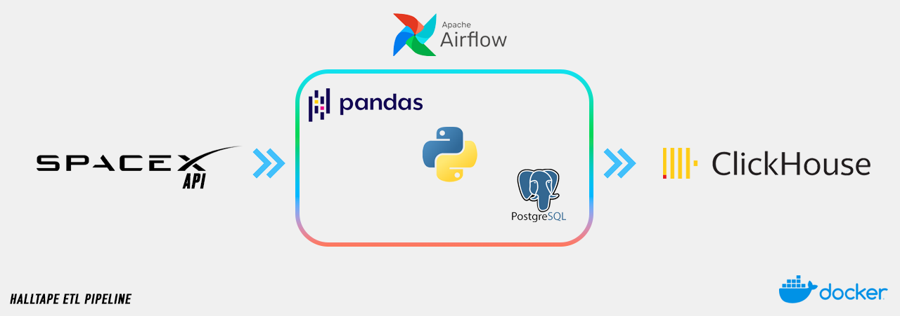

# HalltapeETLPipeline
***


This project is an equivalent of a full-fledged ETL process. Open APIs and CSV tables are used as data sources. The main tool for ETL is Apache Spark. For code debugging, there is a Jupyter Notebook with Pandas and Spark installed inside. Apache Airflow is used as the orchestrator. All data marts are stored in ClickHouse. Visualization is deployed on Apache Superset. A shared folder called data_lake is used as a data warehouse (it can be regarded as S3).

## Getting Started

### Building the Docker Images

To build the Docker images, navigate to the root directory of the project in your terminal and run the following command in background:
```bash
docker-compose up -d
```

To show all the running docker containers
```bash
docker ps
```

To stop all the docker containers
```bash
docker-compose down
```

To go inside the docker container
```bash
docker exec -it <containerID> bash
```

***
## Prerequisites

- Docker: Make sure you have Docker installed on your system. You can download it from [here](https://www.docker.com/products/docker-desktop).
- Docker Compose: Also ensure that Docker Compose is installed. You can find it [here](https://docs.docker.com/compose/install/).

## Services

| Service | Port | User    | Password |
|---------|------|---------|----------|
| Airflow | http://localhost:8080 |   airflow      |    airflow      |
| PostgreSQL | http://localhost:5432 | airflow | airflow         |
| ClickHouse | http://localhost:9000 |  airflow       |   airflow       |
| Jupyter Lab | http://localhost:10000/lab |  -       |   -       |
| Apache Superset | http://localhost:8088 |  admin       |   admin       |
***

### Source
Sources of synthetic data are located in the `synthetic_data` folder. The remaining data can be obtained via `Open API`.

### Jupyter Lab
In `Jupyter Lab`, you can use both `Pandas` and `Apache Spark`. Jupyter Lab has access to the `Data Lake`.

### Data Lake
The `Data Lake` folder is mounted with the containers for `ClickHouse`, `Jupyter Lab`, and `Apache Airflow`. This directory can be regarded as a Data Lake. After extracting data from the source, the transformed data can be placed in this folder, and then loaded into `ClickHouse` via `Airflow`. I also have monitoring set up for the collected data marts, so `logs` folder may appear there, where I track the number of rows.

### Apache Superset
`Apache Superset` is already configured to work with `ClickHouse`. All necessary connectors are installed and configured. `Superset` can connect to both `ClickHouse` and `PostgreSQL`. To connect to `ClickHouse`, specify `host: clickhouse` and `port: 8123`.

### PostgreSQL
The PostgreSQL service is used as the backend database for Airflow. The service uses the `postgres:15` image and exposes the default PostgreSQL port `5432`. The data for the service is persisted in the `postgres-db-volume` volume.

### ClickHouse
The ClickHouse service is used for data storage and querying. The service uses the `yandex/clickhouse-server:latest` image and exposes the default ClickHouse ports `8123` and `9000`. The data for the service is persisted in the `./clickhouse_data` and `./clickhouse_logs` volumes.

### Airflow
The Airflow service is split into three separate services for the webserver, scheduler, and worker. Each service is built from the `Dockerfile` in the `./airflow_docker_image` directory. The services share common environment variables and volumes defined in the `x-airflow-common` section.
