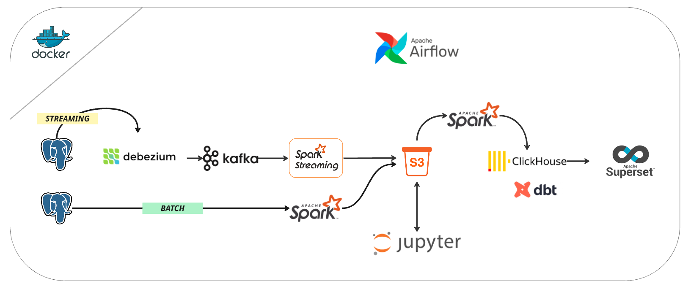

# HalltapeETL

<p align="center">
    
</p>

Проект ETL (Extract, Transform, Load) для обработки и анализа данных в реальном времени с использованием современного стека технологий.

## 🚀 Технологический стек

### Основные компоненты
- **Airflow** - оркестрация ETL процессов
- **ClickHouse** - колоночная СУБД для аналитики
- **Apache Spark** - обработка данных в реальном времени
- **Kafka** - потоковая обработка данных
- **Debezium** - CDC (Change Data Capture) для отслеживания изменений в данных
- **Apache Superset** - визуализация данных
- **Jupyter Notebook** - интерактивный анализ данных
- **DBT** - трансформация данных

### Инфраструктура
- **Docker** - контейнеризация всех компонентов
- **MinIO** - S3-совместимое хранилище объектов
- **Prometheus** - мониторинг метрик
- **Grafana** - визуализация метрик
- **Redis** - кэширование и очереди
- **PostgreSQL** - метаданные Airflow

## 📁 Структура проекта

```
.
├── airflow_dockerfile/    # Конфигурация Airflow
├── clickhouse/           # Конфигурация ClickHouse
├── dags/                 # DAG'и Airflow
├── dbt_click/           # DBT модели для ClickHouse
├── debezium-*/          # Конфигурация Debezium и мониторинга
├── jupyter_dockerfile/  # Конфигурация Jupyter
├── plugins/             # Плагины Airflow
├── scripts/            # Вспомогательные скрипты
├── src/                # Исходный код
├── superset_dockerfile/ # Конфигурация Apache Superset
├── s3_storage/         # Хранилище MinIO
└── synthetic_data/     # Тестовые данные
```

## 🛠 Установка и запуск

1. Клонируйте репозиторий:
```bash
git clone https://github.com/yourusername/HalltapeETL.git
cd HalltapeETL
```

2. Создайте файл `.env` со следующими параметрами:
```env
AIRFLOW_UID=50000
AIRFLOW_GID=0
POSTGRES_USER=airflow
POSTGRES_PASSWORD=airflow
CLICKHOUSE_USER=default
CLICKHOUSE_PASSWORD=your_password
SUPERSET_ADMIN_USERNAME=admin
SUPERSET_ADMIN_EMAIL=admin@example.com
SUPERSET_ADMIN_PASSWORD=admin
MINIO_ROOT_USER=minioadmin
MINIO_ROOT_PASSWORD=minioadmin
MINIO_BUCKET_NAME=data
```

3. Запустите проект с помощью Docker Compose:
```bash
docker-compose up -d
```

## 🔧 Конфигурация

### Порты и доступ
- **Airflow**: http://localhost:8080 (admin/admin)
- **ClickHouse**: 
  - HTTP: 8123
  - Native: 9000
- **Superset**: http://localhost:8088
- **Jupyter**: http://localhost:10000
- **Grafana**: http://localhost:3000
- **Prometheus**: http://localhost:9090
- **Kafka UI**: http://localhost:8082
- **MinIO Console**: http://localhost:9001
- **Kafka Connect**: http://localhost:8083

### Тома данных
- `./data_lake` - основное хранилище данных
- `./s3_storage` - MinIO хранилище
- `./synthetic_data` - тестовые данные
- `./clickhouse` - данные ClickHouse
- `./superset_data` - данные Superset

## 📊 Мониторинг

### Метрики
- **Grafana**: http://localhost:3000
  - Дашборды для Kafka, Debezium, ClickHouse
  - Мониторинг производительности
- **Prometheus**: http://localhost:9090
  - Сбор метрик со всех компонентов
- **Kafka UI**: http://localhost:8082
  - Мониторинг топиков и коннекторов

### Логи
- Логи Airflow доступны в директории `./logs`
- Логи ClickHouse в `./clickhouse/logs`

## 📝 Документация

- [Документация Airflow](https://airflow.apache.org/docs/)
- [Документация ClickHouse](https://clickhouse.com/docs/)
- [Документация Debezium](https://debezium.io/documentation/)
- [Документация Apache Superset](https://superset.apache.org/docs/intro)
- [Документация Apache Kafka](https://kafka.apache.org/documentation/)
- [Документация Apache Spark](https://spark.apache.org/docs/latest/)

## 🤝 Вклад в проект

1. Форкните репозиторий
2. Создайте ветку для новой функциональности (`git checkout -b feature/amazing-feature`)
3. Зафиксируйте изменения (`git commit -m 'Add some amazing feature'`)
4. Отправьте изменения в репозиторий (`git push origin feature/amazing-feature`)
5. Создайте Pull Request

## 📄 Лицензия

Этот проект распространяется под лицензией MIT. Подробности в файле [LICENSE](LICENSE).

## 📧 Контакты

Если у вас есть вопросы или предложения, создайте Issue в репозитории проекта.
